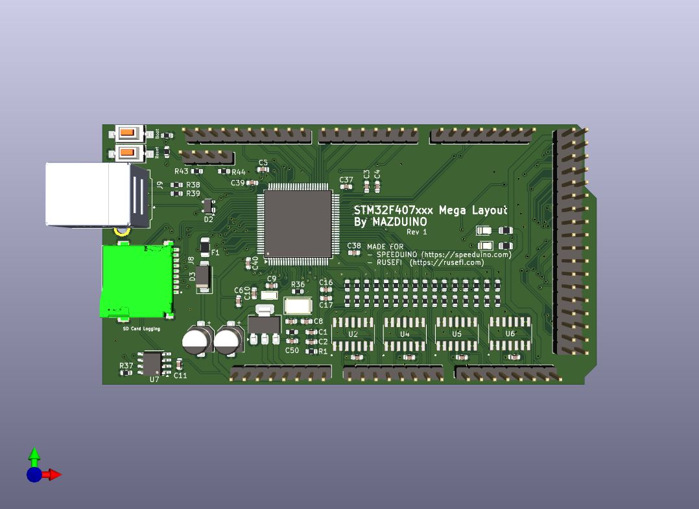

# stm32f407xxx-mega-layout

## Made For Speeduino and RusEFI Firmware
This board is inspired by Pazi88 and Mega100 boards. Thank you very much to those who created the board first.

### Front

### Back

### Schematic 
[schematic-stm32f407xxx-mega-layout.pdf](schematic-stm32f407xxx-mega-layout.pdf)

### Thanks to
- https://github.com/pazi88/STM32_mega
- https://github.com/rusefi/fw-custom-mega100/
